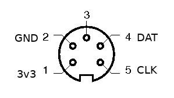

# Microbasic

## Description
This poorly named project is our 
[Hackers In The Bazaar Project 1](https://www3.nd.edu/~pbui/teaching/cse.40842.sp17/project01.html) 
entry.
We plan on winning with it, because it is objectively awesome.

There are three main parts to our project: the keyboard, the monitor,
and the computer.
The computer is powered by an MSP430G2 Launchpad. The computer is responsible
for reading in keystrokes provided by the keyboard, translating keystroke
scancodes into ASCII, interpretting lines of BASIC, and sending
all output to the monitor over serial.
The software for the computer is written in C.

The monitor is a Raspberry Pi Zero with a screen hat from Adafruit. It runs
a simple Linux distribution, and simply runs the GNU screen utility after
booting. It reads in serial commands at 9600 baud and displays them on
the screen. It communicates with the computer over USB, using the
USB to UART adapter present on the Launchpad.

The keyboard is simply an IBM Model M that talks to the computer over PS/2.
It plugs directly into the Launchpad with a few jumper wires and a connector
that some idiot hotglued to a black box.

The project was constrained to mimick hardware of the past. The processor,
an MSP430G2553, has only 16KB of flash memory and 512 BYTES of RAM. Its
speed is fairly generous at 16MHz, but as it is the only chip we used, it
has a fairly high workload. The keyboard protocol was figured out in a very
hackerish manner, as there is very little documentation - we poked it
with wires until we got results. We made a number of design choices to
minimize our RAM usage that really drove up our ROM usage. We ran into
plent of issues with heap fragmentation, and ended up statically allocating
as much as we could ever need.

Historically, BASIC became a popular language among computer users, who
wanted to be able to do something with their computers rather than spend
time trying to figure out how to program them in assembly. BASIC was
high level enough for many inexperienced users to use it while also being
simple enough to fit in the small memory footprints of the day.
In fact, some early Tiny BASIC interpreters fit in a mere 3KB bytes of RAM.

Our project also makes use of ANSI terminal standards. Our CLEAR command,
backspace key, and enter key all use character sequences for controlling the
terminal. We also made the letter B show in green when typed by
the user because it is the first letter of "Breff", the name of the
CSE Power Couple&trade;, as well as the favorite color of the relationship's
pants-wearer, Breezy.

## Usage
Most importantly, you need the proper hardware (Pi Zero, Adafruit Pi HAT,
IBM Model M, MSP430G2), all the proper cables and circuits, (extra points
if you hotglued it all together inside a literal black box with drilled holes
for cables), and a will to hack. Then, you need to install 
[Energia](http://energia.nu/) in order to run the LaunchPad, and download
the [TI udev rules](http://energia.nu/files/71-ti-permissions.rules) in order
to program as a regular user. Also you need Linux because Windows sucks.

## Hardware
The MSP430 launchpad connects to the
raspberry pi zero over USB. The hat connects directly to the pi zero. The
launchpad connects to the keyboard
through a DIN-5 connector with the
following pinout:  

The CLK line connects to pin 1.4, and the DAT line connects to pin 1.5.
3v3 and GND are connected to their
respective power rails.

## Contributors
[John Westhoff](https://github.com/johnathonnow)  
[Breanna Devore-McDonald](https://github.com/bdevorem)

## TODO
[x] Lexer  
[x] Parser  

